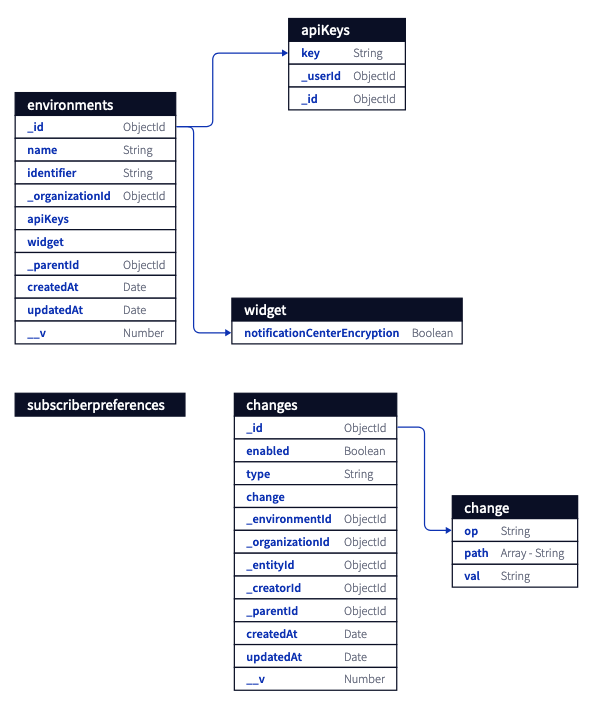

# Mongo to [D2](https://github.com/terrastruct/d2#related) (M2D2)

## Maintained and supported by

<div align="center">
  <a href="https://novu.co" target="_blank">
  <picture>
    <source media="(prefers-color-scheme: dark)" srcset="https://user-images.githubusercontent.com/2233092/213641039-220ac15f-f367-4d13-9eaf-56e79433b8c1.png">
    
  </picture>
  </a>
</div>

[D2](https://github.com/terrastruct/d2) Diagrams are very useful know exactly what schemas your database is following.
If you have a mongo database that you'd like to diagram, you can use this tool to generate a schema for it.

Here is an example of the output of this tool rendered in Terrastruct. 



## This Tool Supports
- Merging the same document referenced in other documents into the same table
- Recursively mapping Arrays and Documents
- Mapping only the user generated databases

## Installation

- Clone this repo
- `npm install`

## Usage

```sh
$ node index "mongodb://localhost:27017"
```

## Database Setup

Due to mongo having no actual relational data in the database,
we have to rely on naming to set up our correlation.
For example, if we have a collection named "templates" and a document links to its id 
then we expect the document to contain a field called "_templateId".

## Future

We will look in the future to move this tool to a npm distributed cli tool for better maintainability
and additional features.

In addition, we will look to support a way to put in custom mapping so your database does not have to change to use this tool.
 
If you wish to contribute to this tool, <a href="https://discord.novu.co">Come Join Our Discord</a> 
and discuss with the team what you would like to do. 

